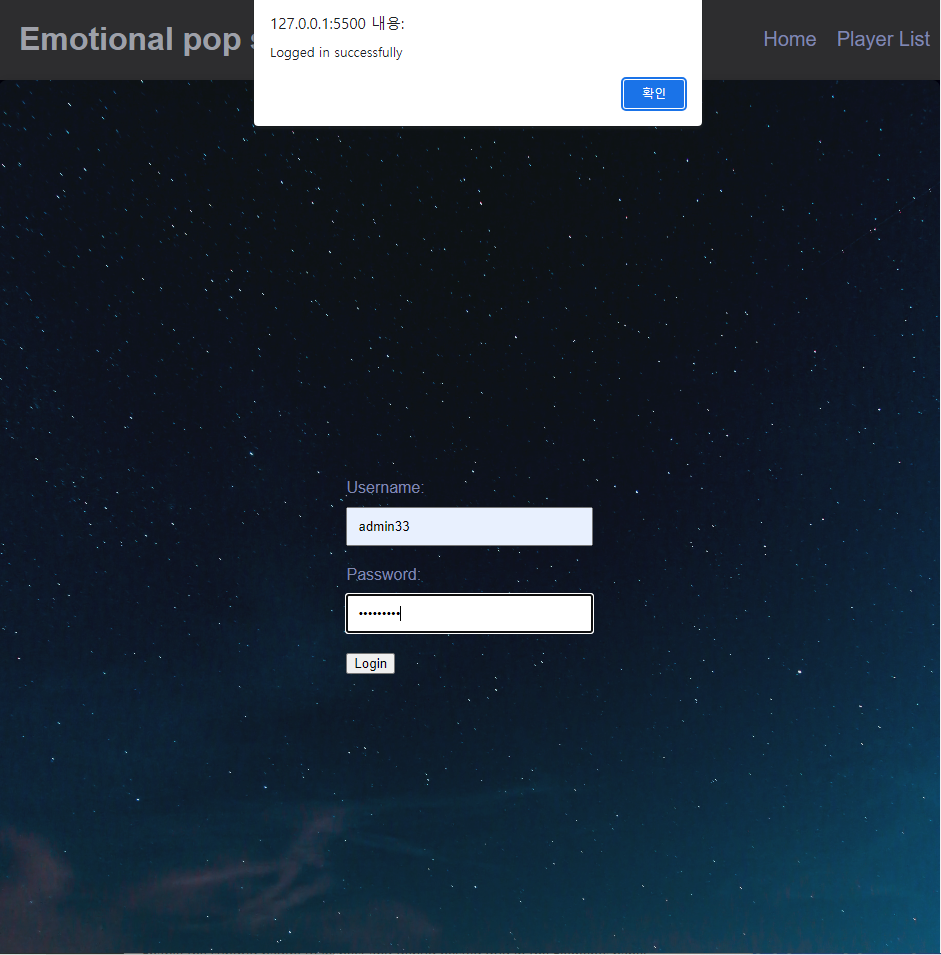

# 3S1A
Share songs suggested by AI

## 연관 Repository
- [AI-Suggested-Playlist](https://github.com/AMinSC/AI-Suggested-Playlist)
    - 기준 repo
    - [서비스이동](https://majestic-salamander-540c1f.netlify.app)
    - HTML, CSS, JavaScript, Netlify(serverless)
    - Google YouTube Data API v3
    - Google YouTube IFrame Player API

- [Share-songs-suggested-by-AI](https://github.com/AMinSC/Share-songs-suggested-by-AI)
    - 서비스 배포 Frond-end
    - HTMl, CSS, JavaScript

## 서비스 목적
AI가 추천하는 노래 공유

## 개발 환경
    - Python 3.10.11
    - Django 4.2.2
    - django-cors-headers 4.2.0
    - djangorestframework 3.14.0
    - djangorestframework-simplejwt 5.2.2
    - python-decouple 3.8

그 외 자세한 버전은 requirements.txt를 참고 부탁드리겠습니다.

## 배포 환경

- AWS Lightsail (ubuntu 22.04 LTS)
    - nginx 1.18.0
    - uWSGI 2.0.21
    - Certbot으로 HTTPS활성화

## 폴더 트리

```
\
├─config
│  ├─chatbot
│  │  ├─migrations
│  │  └─templates
│  │     └─chatbot
│  ├─config
│  ├─post
│  │  └─migrations
│  ├─templates
│  └─user
│      └─migrations
└─venv
```

## ERD


## 구현
1. 메인화면
    

2. 회원가입
    

1. 로그인
    

1. 로컬 저장소
    

1. 챗봇
    

## 개선사항
- 로그인 상태에서 챗봇 이용
- 유저에 맞는 대화 리스트
- 맘에드는 메시지(대화 중 1개) 포스팅
- 카테고리별 좋아요순
- 유저 등급
- OAuth2 연결 
